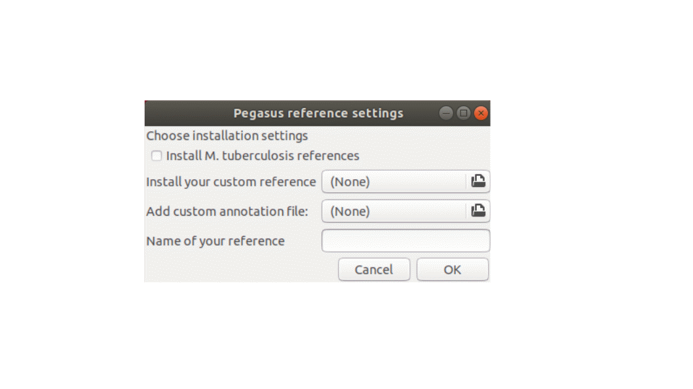

# Pegasus gene fusions pipeline
Pegausus deletion and gene fusion caller for Illumina short read sequencing files currently compatible with M. tuberculosis, however it can be configured for other bacteria. The preferred method to use this software is with the docker container, which specifically detects gene fusions. Thus the docker container has less functionality than building the program from source but is the most stable and condense version. To cite the Pegasus pipeline please see our manuscript: https://doi.org/10.1093/nargab/lqaa033 

This implementation is a minimal version of Pegasus focussed on gene fusions and availible as a docker container. Everything needed is saved within the container and thus no installations are required. Furthermore this container can be used wherever docker is availible.  The container is preconfigured to work with M. tuberculosis H37Rv and CDC1551 as references however other genomes can be configured as well. Thi
<br>

To use the docker container pull it from docker hub https://hub.docker.com/r/jamesgallant/pegasus
<br>
on linux:
```
sudo docker pull jamesgallant/pegasus
```
Prepare your files by creating a directory that includes raw illumina files and a file listing each sample line by line. The illumina files require the following naming convention: mysample1_R1_001.fastq.gz, mysample1_R2_001.fastq.gz and the sample file should look like this as an example for three samples:
```
mysample1
mysample2
mysample3
````
Run the container and mount the directory containing your illumina files and samples text file. Remeber that the paths need to be absolute to connect the directories between your host system and the container. The host system and the docker system is separated by a **:**. In the example below myfiles would be the directory to be connected.

```
sudo run docker -v /home/user/path/to/myfiles:/home/pegasus/myfiles -it jamesgallant/pegasus
ls
```
You are now in the container and should see all the files availible as well as your **myfiles** directory. The rest of the docker section handles commands in the container
## Running the pipeline
Make a output directory in your mounted volume 
```
mkdir ./myfiles/out
```
Run the pipeline by calling the script and adding the positional arguments.
```
bash Pegasus.sh
```
|Position       |argument       |data type                |Long description                                      |
|---------------|---------------|-------------------------|------------------------------------------------------|
|1              |`-h`,`--h`     |                         |Display the help menu                                 |
|1              |raw files      |directory path           |Path to the raw files                                 |
|2              |samples        |text file                |List of identifiers for the raw files                 |
|3              |output dir     |directory path           |Path where files should be saved                      |
|4              |threads        |Interger                 |Number of CPU cores to allocate                       |
|5              |ram            |Interger                 |Ammount of RAM to allocate                            |
|6              |Gene fusions   |Boolean (TRUE or FALSE)  |Find chimeric genes                                   |
|7              |Reference      |H37Rv or CDC1551         |Which reference should be used                        |
|8             |Verbose        |Boolean (TRUE or FALSE)  |Run in vebose mode to debug the platform              |

## output
The main outputs are in the results folder for each sample. The results folder contains the bam files as well as the putative chimeras for that sample. Directories for each potential chimera is also created which contains the fasta of the multigene deletion as well as a denovo assembled consensus sequence in the .NoNs.fasta file. This consensus sequence can be used in programs such as ORF finder to check for six frame tranlsations.

## custom reference
It is possible to configure your own reference with some caviats. The detection pipeline is not built to function with plasmids so remove any plasmids from the reference fasta file. Make sure the fasta file is named .fasta and not .fna or .fa. Also unzip the reference file. Use NCBI's tabular output for the annotation file, other formats are not accepted. see and example here: <a href="https://www.ncbi.nlm.nih.gov/genome/browse/#!/proteins/166/159857|Mycobacterium%20tuberculosis H37Rv/"> NCBI annotation file </a>. 
<br>
Add these files to the folder used to import data into the docker container. and run the following script and with the arguments.

```
bash build_references.sh [arg 1] [arg 2] [arg 3]
```
These are the accepted positional arguments:
|positition |arg              |dtype     |description                              |
|-----------|-----------------|----------|-----------------------------------------|
|1          |custom ref       |filepath  |path toreference file in .fasta format   |
|2          |annotation file  |filepath  |Tabular annotation file from NCBI        |
|3          |name of reference|char      |Name of the bacteria, eg. Salmonella     |

This will configure your reference and can be verified by checking the reference foloder for a new directory with the name provided.

```
cd ./references
ls
```
# Building from source
Building from source command line version is stable and has similar function to the docker version however some additional features are availible. This version has dependencies which may cause it to be unstable at times and therefore the docker version is favoured. 
<br>
<br>
These features are availible:
+ Gui for reference building
+ de novo assembly for target regions
+ structural variant detection
+ SNP detection (not annotated)

## Installation
Instalation consists of four steps to complete, 1) Confgiure java 2) download the repo and run the build.sh script 3) get novoalign from their website, and 4) configure references. The build.sh script installs most dependencies and can take a while to run. Follow these prompts to install the software on your linux box. 

<br><br>**Configure java:**<br>
This program runs on java 8 and probably needs to be installed. First check the current version:
```
java -version
```
The output should look something this and check if your version also starts with 1.8
```
openjdk version "1.8.0_242"
OpenJDK Runtime Environment (build 1.8.0_242-8u242-b08-0ubuntu3~18.04-b08)
OpenJDK 64-Bit Server VM (build 25.242-b08, mixed mode)
```
If you have a different version follow these steps to install older java versions and switch between versions.
```
sudo apt-get install openjdk-8-jre
```
Next switch to the jre-8 version in this case it is option 2:
```
sudo update-alternatives --config java
```
After giving your password you should get a view similiar to this:
```
There are 2 choices for the alternative java (providing /usr/bin/java).

  Selection    Path                                            Priority   Status
------------------------------------------------------------
  0            /usr/lib/jvm/java-11-openjdk-amd64/bin/java      1111      auto mode
  1            /usr/lib/jvm/java-11-openjdk-amd64/bin/java      1111      manual mode
* 2            /usr/lib/jvm/java-8-openjdk-amd64/jre/bin/java   1081      manual mode

n/java       1500      manual mode
```

Add the correct selection for java-8, in this case it was two. Double check with ```java -version``` and to switch versions again: 
```sudo update-alternatives --config java```

<br><br>**Installing the repo:**<br>
A internet connection is required<br><br>
Install with git and  run build.sh
```
git clone --recursive https://github.com/JamesGallant/Genomics.git
cd Genomics
bash build.sh
```
or download the zip file to your prefered destination and unzip.
```
unzip ./Genomics-master.zip
mv ./Genomics-master ./Genomics
cd Genomics
bash build.sh
```
The build script will setup the environment on your system as well as gather and compile third party software. Wait till this has finished before installing novoalign.

<br><br>**Get novoalign:**<br>
Novocraft has a free version of **Novoalign** but we cannot distribute it here so this has to be installed mannually. Navigate to <a href="http://www.novocraft.com/support/download/" target="_blank"> Novocraft </a> and click the download button. Navigate to **version 3.07.00**, this software was tested on this specific version but higher versions should work as well. Copy this needs file to the **programs** folder in the **Genomics** folder and rename to **novocraft.tar.gz**, this naming is important. Once all of this is done, untar the file and were done with novo

```
cd programs/
tar -xvf novocraft.tar.gz
cd ../
```
<br><br>**Build the reference files:**<br>
Next we need to create and index the references this is done automatically via our gui. This sccript will only work if you have already run the build.sh script and installed novoalign. The reference builder can be used multiple times. Initialise the interface by calling this script:
```
bash build_references.sh
```


Click the checkbox to install M. tuberculosis H37Rv and M. tuberculosis CDC1551 as reference files. To add a custom reference, upload the fasta file and annotation file. Use NCBI's tabular output for the annotation file, other formats are not accepted. see and example here: <a href="https://www.ncbi.nlm.nih.gov/genome/browse/#!/proteins/166/159857|Mycobacterium%20tuberculosis H37Rv/"> NCBI annotation file </a>. 

## Command line usage
remove any trailing \r characters just in case.
```
sed -i 's/\r$//' Pegasus.sh
sed -i 's/\r$//' Pegasus_functions.sh
```
Below are the arguments (`[args]`):
|Position       |argument       |data type                |Long description                                      |
|---------------|---------------|-------------------------|------------------------------------------------------|
|1              |`-h`,`--h`     |                         |Display the help menu                                 |
|1              |raw files      |directory path           |Path to the raw files                                 |
|2              |samples        |text file                |List of identifiers for the raw files                 |
|3              |output dir     |directory path           |Path where files should be saved                      |
|4              |threads        |Interger                 |Number of CPU cores to allocate                       |
|5              |ram            |Interger                 |Ammount of RAM to allocate                            |
|6              |call snps      |Boolean (TRUE or FALSE)  |Find single nucleotide polymorphisms, no annotations  |
|7              |call sv's      |Boolean (TRUE or FALSE)  |Find structural variants, annotations availible       |
|8              |Gene fusions   |Boolean (TRUE or FALSE)  |Find chimeric genes                                   |
|9              |Reference      |H37Rv or CDC1551         |Which reference should be used                        |
|10             |Target regions |text file                |Regions of the genome to analyse                      |
|11             |Verbose        |Boolean (TRUE or FALSE)  |Run in vebose mode to debug the platform              |
  
To run the pipeline add the arguments in order
 ```
 bash Pegasus.sh [arg1][arg2][arg3]....[arg13]
 
 ```
 
 ## file requirements:
 **Raw files**
 These files need a unique identifier following by *R1_001.fastq.gz* for forward file and *R2_001_fastq.gz* for the reverse raw file. It should looks something similiar to this:
 ```
 Genome1_R1_001_fastq.gz
 Genome2_R2_001_fastq.gz
 ```
 **samples**
 This file should contain the unique identifier only and have one identifier per line, similiar to this.
 ```
 Genome1
 Genome2
 Genome3
 ```
 **Target regions**
 This file stipulates the regions of interest. Our software will go to the positions stipulated here and pull out the specififed region of the genome. Each line should contain a gene name with a 3' and 5' position separted by **tabs**.
 Similiar to this:
 |<!-- -->|<!-- -->  |<!-- -->|
 |--------|----------|--------|
 |Gene1   |1         |100     |
 |Gene5   |200       |300     |
 |Gene100 |1000      |2000    |

 The pipeline will iterate through each Gene providided here for each strain provided in the sample list file. This will pull out coverage of the region to which deletions can be inferred. This is not used for gene fusions, gene fusions uses automated detection with split read callers. 
 
 ## Output
 **Single nucleotide polymorphisms**
 This is not really the idea behind this software but can be done anyway, although these won't be annotated only gene coordinates will be provided in vcf format.
 
 **Structural variants**
 Concatenated file of all deletions found by Lumpy and Delly structural variant callers. This file has the coordinates and annotations of the affected genes or intergenic regions. 
 
 **Targeted regions**
 This outputs a text file containing the read counts or coverage for each base in the region specified. A rudimentary plot is also drawn from this data to quickly see if the coverage drops or not.
 
 **Gene fusions**
 A list of multigene deletions that fall within open reading frames can be found within the chimeric_genes folder. 
 The *de novo* assembled putative gene fusions can be found in the folder named chimeric genes and within that directory look for a contig_ordering folder. The folder will be named abacas followed by gene names. Naviagate to your favorite gene and open the .NoNs file, this contains the consensus sequence without N's. Use this sequence to confirm the translation and the gene fusion, we used ORF finder from NCBI.
 
